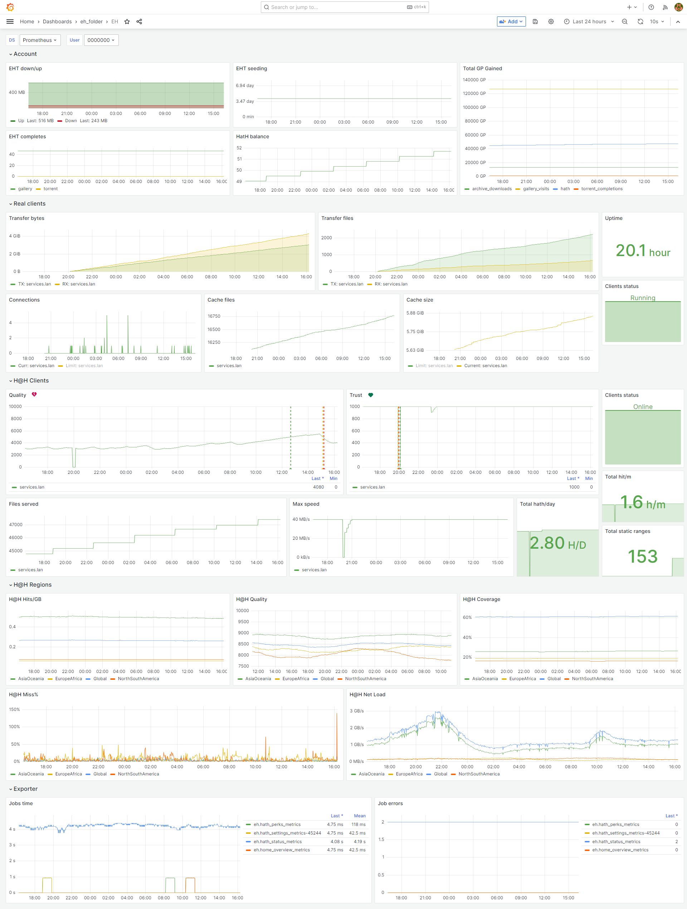

# EHentai prometheus metrics collector


## About
This soft periodically checks the specified e-hentai pages and extracts metrics compatible with prometheus. Every page presented with scheduled jobs.

> All metrics always have first tag `user` that represent account user id

> Docker-Compose example located in [docker-compose.example](./docker-compose.example)

## Config
Required site client settings `EhClient{}`:
```js
{
  "MemberId": "9965000",                            //* ipb_member_id cookie
  "PassHash": "bbc23afa07096d2f700b1d48c1ba777f",   //* ipb_pass_hash cookie
  "SessionId": "5529515b6d7a892362de74e2b444c987",  //* ipb_session_id cookie
}
```

Logging. By default YOU CAN SKIP this section but may fill `Serilog{}`:
```js
{
  "LevelPreset": "dev",                         // dev/prod switch verbosity
  "DisableElastic": false,                      // set false if you use elastic logging
  "ElasticUris": [ "https://es-node1.space" ]   // elastic nodes addrs
}
```

Every job deined with json in `AppQuartz{} => Jobs[]`:
```js
{
  "Enable": true,                             //* enable/disable job
  "TriggerOnStartup": true,                   //  execute on service start if enabled
  "Name": "hath_settings_metrics-45044",      //* unique name
  "Group": "eh",                              //* jobs group
  "CronExpression": "0 */10 * ? * *",         //* schedule in cron format (ex. every 10 minutes)
  "JobType": "CollectHathSettingsMetricsJob", //* job type
  "JobData": { "ClientId": 45044 }            //  some job types require additional data
}
```


## Allowed jobs
- [HathStatus](#CollectHathStatusMetricsJob)
- [HathSettings](#CollectHathSettingsMetricsJob)
- [HathPerks](#CollectHathPerksMetricsJob)
- [HomeOverview](#CollectHomeOverviewMetricsJob)

### Collect`HathStatus`MetricsJob
```
  JobType: CollectHathStatusMetricsJob
  JobData: -
Site page: /hentaiathome.php
```
|Name|Desc|Labels|Type|
|----|----|------|----|
|eh_hath_regions_netload_mbps|E-Hentai H@H current network load|region|Gauge|
|eh_hath_regions_miss_percent|E-Hentai H@H current miss %|region|Gauge|
|eh_hath_regions_coverage_percent|E-Hentai H@H coverage|region|Gauge|
|eh_hath_regions_hits_per_gb_ratio|E-Hentai H@H Hits/GB ratio|region|Gauge|
|eh_hath_regions_quality_number|E-Hentai H@H quality|region|Gauge|
|eh_hath_clients_files_served_number|E-Hentai H@H client files served|client_name, client_id|Gauge|
|eh_hath_clients_max_speed_kbps|E-Hentai H@H client max kb/s|client_name, client_id|Gauge|
|eh_hath_clients_trust_number|E-Hentai H@H client trust|client_name, client_id|Gauge|
|eh_hath_clients_quality_number|E-Hentai H@H client quality|client_name, client_id|Gauge|
|eh_hath_clients_hitrate_number|E-Hentai H@H client hits per minute|client_name, client_id|Gauge|
|eh_hath_clients_hathrate_number|E-Hentai H@H client hath per day|client_name, client_id|Gauge|
|eh_hath_clients_status_enum|E-Hentai H@H client status|client_name, client_id|Gauge|


### Collect`HathSettings`MetricsJob
```
  JobType: CollectHathSettingsMetricsJob
  JobData: ClientId = H@H client id
Site page: /hentaiathome.php?cid=<ClientId>&act=settings
```
|Name|Desc|Labels|Type|
|----|----|------|----|
|eh_hath_clients_ranges_number|E-Hentai H@H client static ranges|client_id|Gauge|


### Collect`HathPerks`MetricsJob
```
  JobType: CollectHathPerksMetricsJob
  JobData: -
Site page: /hathperks.php
```
|Name|Desc|Labels|Type|
|----|----|------|----|
|eh_hath_balance_number|E-Hentai current hath balance||Gauge|


### Collect`HomeOverview`MetricsJob
```
  JobType: CollectHomeOverviewMetricsJob
  JobData: -
Site page: /home.php
```
|Name|Desc|Labels|Type|
|----|----|------|----|
|eh_eht_uploaded_mb|E-Hentai EHTracker uploaded megabytes||Gauge|
|eh_eht_downloaded_mb|E-Hentai EHTracker downloaded megabytes||Gauge|
|eh_eht_seed_minutes|E-Hentai EHTracker seeding minutes||Gauge|
|eh_eht_completes_number|E-Hentai EHTracker completes|type|Gauge|
|eh_eht_up_down_ratio|E-Hentai EHTracker up/down ratio||Gauge|
|eh_gp_gained_number|E-Hentai Total GP Gained from|type|Gauge|


## Scrapper metrics
|Name|Desc|Labels|Type|
|----|----|------|----|
|eh_job_run_time_seconds|Scheduled job execution run time in seconds|name|Histogram|
|eh_job_failures_number|Scheduled job execution errors|name|Counter|


### Grafana sample dashboard

\* `Real clients` graphs filled with metrics from [modified H@H client](https://github.com/mixa3607/EH_hath)
